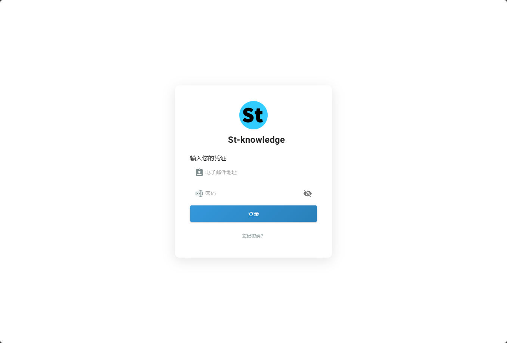

# wikijs_login_css
一个纯白的wikijs登录界面css文件,需要自行覆盖css文件，搭配[这个白色主题样式使用]([https://markdown.com.cn](https://github.com/AurLemon/wikijs-citizen-styles))
## 使用方法

复制文件到wikijs根目录/_assets/css/login.ec84cd42b23af7420dcf.css替换使用，替换前请备份原文件，不同服务可能css名称不同

登录页背景图地址：wikijs根目录/_assets/img/splash/1.jpg，可自行更换或删除。
效果如下：
!(https://github.com/yu-urls/wikijs_login/blob/main/img/image.png)
!(tree/main/img/image.png "Magic Gardens")

